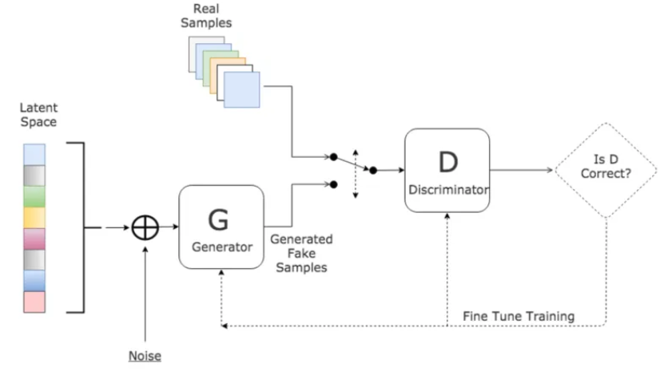
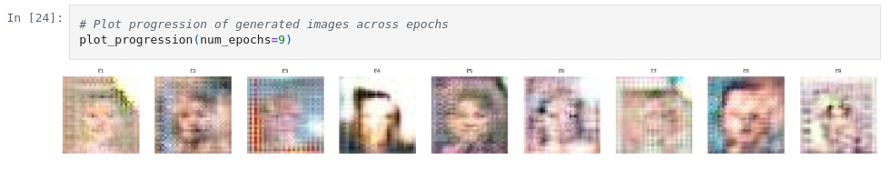

# Face Creation using Generative Adversarial Networks (GANs)


<p align="center">
  
</p>

## Introduction

This project demonstrates the creation of realistic human faces using Generative Adversarial Networks (GANs), leveraging the CelebA dataset. The CelebA dataset comprises over 200,000 celebrity images, each annotated with 40 binary attributes, making it ideal for training deep learning models in face generation tasks.


## Table of Contents
1. [Overview](#overview)  
2. [Dependencies Installation](#dependencies-installation)  
3. [Environment Setup](#environment-setup)  
4. [Dataset](#dataset)  
5. [Data Processing](#data-processing)  
6. [Visualizing Sample Data](#visualizing-sample-data)  
7. [Discriminator Model](#discriminator-model)  
8. [Generator Model](#generator-model)  
9. [GANs Model Combination](#gans-model-combination)  
10. [Training and Visualizing](#training-and-visualizing)  
11. [Results and Insights](#results-and-insights)  
12. [Conclusion](#conclusion)  
13. [License](#license)
    
## Overview
Generative Adversarial Networks (GANs) are powerful models capable of generating realistic synthetic data. This project focuses on generating RGB face images of size 32x32 pixels using the CelebA dataset, a large-scale face attributes dataset. The GAN framework consists of two components:
- Generator: Creates synthetic images aiming to fool the discriminator.
- Discriminator: Classifies images as real (from dataset) or fake (from generator).
The networks are trained in an adversarial setting where both improve iteratively.

## Dependencies Installation
Ensure you have Python 3.8+ installed. Install the required packages via pip:
```bash
pip install tensorflow matplotlib numpy pandas
```
For more complete environment setup, see the Environment Setup section.

## Environment Setup

This project is tested with:
-  Python 3.8+
-  TensorFlow 2.13.0
-  NumPy 1.24.4
-  Matplotlib 3.7.2

We recommend running this notebook or script on a machine with a GPU for faster training. You can use:
-  Local machine with CUDA-enabled GPU
-  Google Colab (free GPU environment)

1. Import Libraries
```bash
import os
import time
import zipfile
import numpy as np
import tensorflow as tf
import matplotlib.pyplot as plt
import matplotlib.image as mpimg

from mpl_toolkits.axes_grid1 import ImageGrid

from tensorflow.keras import Model, Input
from tensorflow.keras.optimizers import Adam
from tensorflow.keras.initializers import HeUniform
from tensorflow.keras.layers import Conv2D, Conv2DTranspose, Dense, Flatten
from tensorflow.keras.layers import BatchNormalization, LeakyReLU, Dropout, Reshape, Activation
```
2. Mount Google Drive
```bash
from google.colab import drive
drive.mount("/content/drive", force_remount=True)
```

## Dataset

- The CelebA dataset, introduced by Liu et al., contains:
    -  202,599 face images
    -  10,177 identities
    -  40 binary attribute labels per image
    -  5 facial landmark locations
- These attributes include features like Smiling, Male, Eyeglasses, Bald, and Wavy_Hair, among others. The dataset is available for download from Kaggle.
- You can download it from [this link]([https://www.kaggle.com/datasets/datatattle/covid-19-nlp-text-classification](https://www.kaggle.com/datasets/jessicali9530/celeba-dataset))

## Data Processing
-  In this project, the primary preprocessing step applied to the CelebA dataset images is normalization.
-  Each image pixel value is scaled from the original [0, 255] range to the normalized range [-1, 1], which helps stabilize and speed up the GAN training.
```bash
# Normalize images to [-1, 1] range and optimize data pipeline
dataset = dataset.map(lambda x: x / 255.0)
```

## Visualizing Sample Data
<p align="center">
  
</p>

## Discriminator Model
<p align="center">
  
</p>

## Generator Model
<p align="center">
  
</p>

## GANs Model Combination
<p align="center">
  
</p>

## Training and Visualizing
During training, the GAN model alternates between optimizing the discriminator and the generator. 
-  The discriminator learns to distinguish between real images from the CelebA dataset and fake images produced by the generator, while the generator strives to produce realistic images to fool the discriminator.
-  Training progress is monitored by visualizing generated images at regular intervals, allowing observation of improvements in image quality and diversity over epochs.
Loss metrics for both models are tracked to ensure stable convergence and to detect potential issues like mode collapse.

## Results and Insights
<p align="center">
  
</p>

- The trained GAN effectively learned to generate realistic 32x32 RGB face images from the CelebA dataset. 
- During training, the discriminator and generator losses and accuracies show balanced improvements, indicating stable training progress.
- For example, at epoch 9 and batch 1583, the training metrics were:
```bash
[E09 | B1583] D(real): loss=0.0726, acc=0.9724 | D(fake): loss=0.0726, acc=0.9724 | G: loss=0.0983, acc=0.9748
```
- These results demonstrate that the discriminator accurately distinguishes real from fake images with over 97% accuracy, while the generator produces convincing fake images that successfully fool the discriminator with a similar accuracy level.
- This balance suggests effective adversarial training, resulting in high-quality generated face images. Future work can build on this foundation by increasing image resolution or refining model architectures.

## Conclusion
- This project successfully implemented a GAN model that can generate realistic face images using the CelebA dataset. It serves as a foundational step in understanding generative modeling with deep learning.
- However, due to the limited image resolution and modest training duration, the results can be further enhanced by:
  - Increasing image size (e.g., 64x64 or 128x128)
  - Using deeper architectures like DCGAN or StyleGAN
  - Accessing more computational power (GPUs/TPUs) for longer and higher-capacity training
- With these improvements, the quality and realism of generated images can be significantly increased.
  
## License
- This project is licensed under the MIT License - see the LICENSE file for details.
- Feel free to adjust any details to better fit your specific implementation or project structure.
